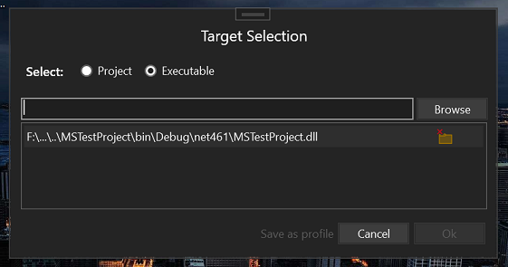
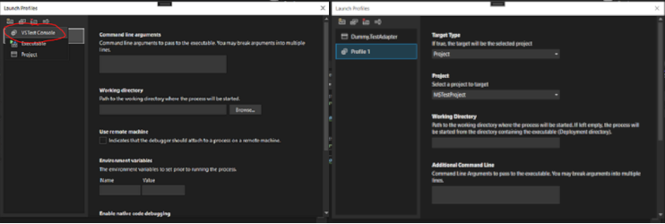

# MSTest Adapter Debugger Extension for Visual Studio

## Overview

The MSTest Adapter Debugger Extension is a Visual Studio extension designed to simplify the process of debugging MSTest Adapters. This extension streamlines the launching of vstest.console.exe and attaching the debugger to the process, making it as simple as a click in Visual Studio. It offers two main usage scenarios: a generic debugging session and the ability to create and save custom launching profiles.

## Features

### 1. Generic Debugging Session

The extension provides a quick and easy way to initiate a generic debugging session for MSTest Adapters. Follow these steps:

- Open your test project in Visual Studio.
- Click on the "Debug" button in the toolbar.
- Select the "MSTest Adapter" option from the dropdown menu.

This will launch vstest.console.exe and automatically attach the debugger to the process, streamlining the debugging process.

### 2. Custom Launching Profiles

For more advanced and customizable scenarios, the extension allows you to create and save launching profiles. This is particularly useful when you need to specify environment variables, vstest.console target, or other settings.

Follow these steps to create a launching profile:

- Open your test project in Visual Studio.
- Navigate to the "Debug" menu and select "MSTest Adapter Debugger" > "Manage Launching Profiles."
- Create a new profile and configure the desired settings, such as environment variables and vstest.console target.
- Save the profile for future use.

## Installation

To install the MSTest Adapter Debugger Extension, follow these steps:

1. Open Visual Studio.
2. Navigate to the "Extensions" menu and select "Manage Extensions."
3. In the "Extensions" window, search for "MSTest Adapter Debugger."
4. Click "Download" and then "Install."

The extension will be added to your Visual Studio environment, and you can start using it immediately.

## Support and Feedback

For any issues, questions, or feedback, please [open an issue on GitHub](https://github.com/fkpama/VSTestConsoleDebugger/issues).

## Contributing

Contributions are welcome! If you have suggestions, improvements, or bug fixes, please submit a pull request on the GitHub repository.

## License

This extension is licensed under the MIT License - see the [LICENSE](./LICENSE.txt) file for details.
